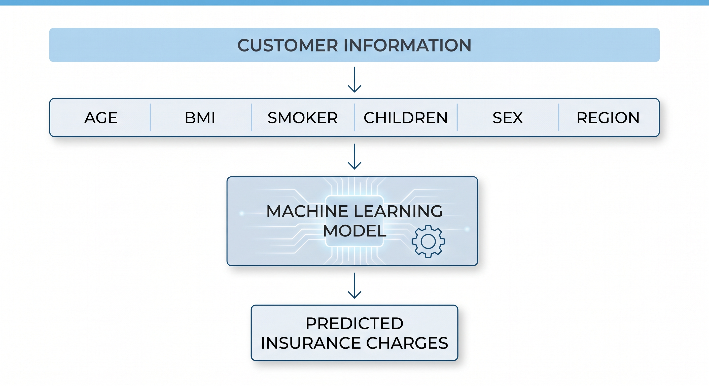
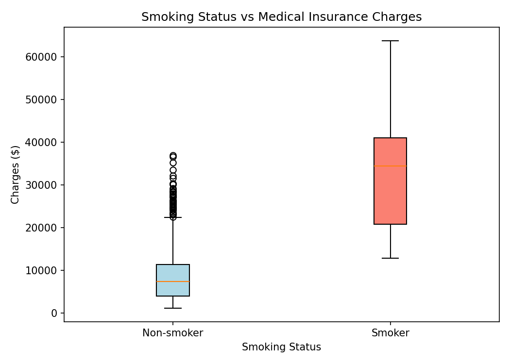
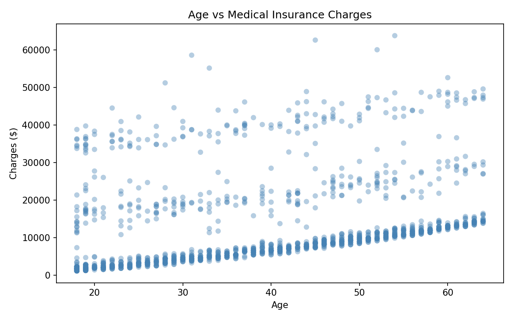
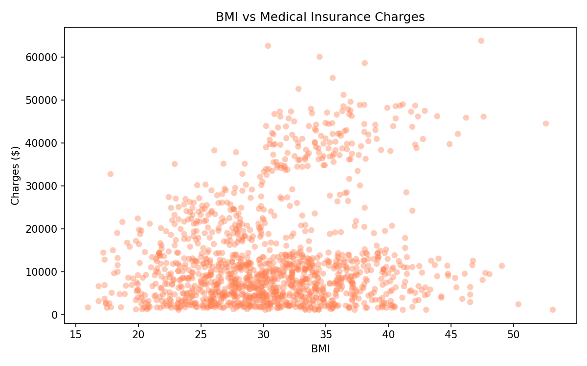
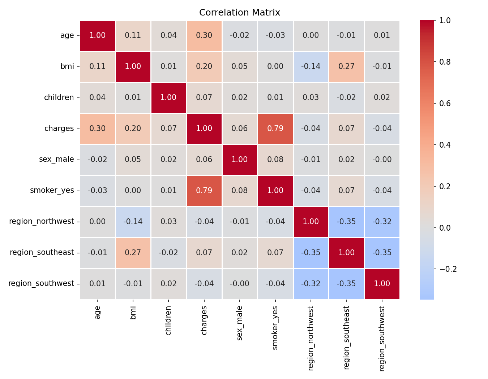
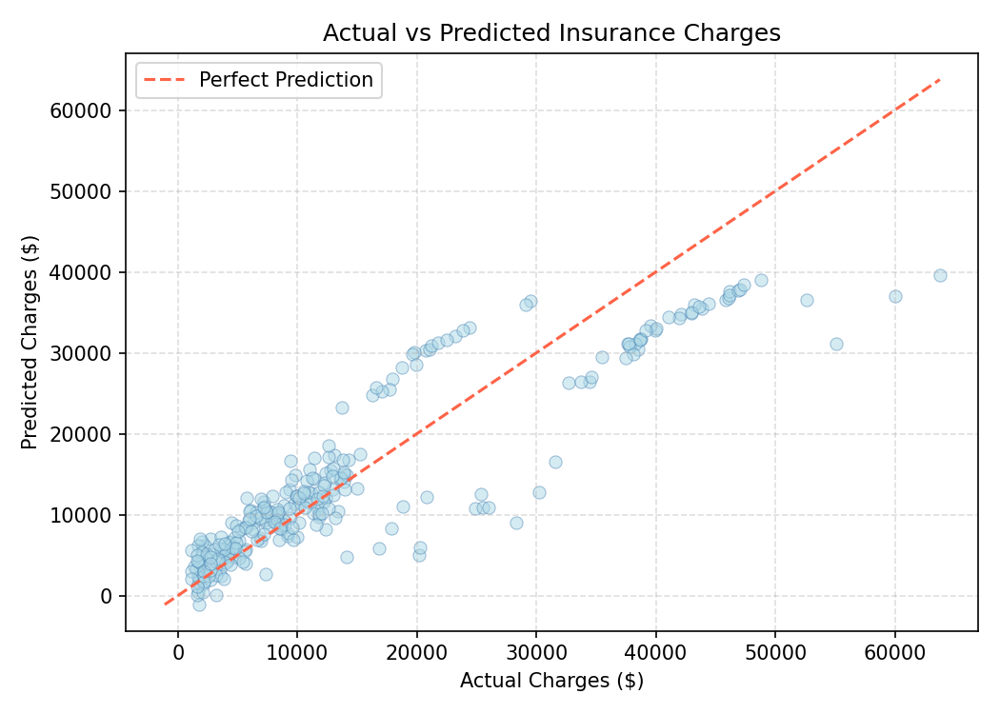

# Medical Insurance Cost Prediction

A machine learning project that predicts individual medical insurance charges based on personal and demographic information. Built using Linear Regression and deployed as an interactive Streamlit web application.

---

## Problem Statement

Medical insurance companies need to estimate the expected healthcare cost for their customers before pricing or reviewing policies. Insurance charges vary significantly depending on factors such as age, BMI, smoking status, number of children, gender, and region.

This project builds a regression model that learns the relationship between these features and historical insurance charges, then predicts the expected cost for a new customer.

---

## Project Objective

This is a **supervised regression problem**.

The model takes six customer attributes as input and predicts the estimated annual medical insurance charge (`charges`) in US dollars.

---

## Dataset

| Property | Value |
|---|---|
| **Name** | Medical Insurance Cost Personal Dataset |
| **Source** | Kaggle |
| **URL** | https://www.kaggle.com/datasets/rahulvyasm/medical-insurance-cost-prediction |
| **Format** | CSV |
| **Raw rows** | 2,772 |
| **Columns** | 7 |
| **After deduplication** | 1,337 rows |
| **Target variable** | `charges` |

---

## Features

| Feature | Type | Description |
|---|---|---|
| `age` | int | Age of the insured individual |
| `sex` | object | Gender (`male` / `female`) |
| `bmi` | float | Body Mass Index |
| `children` | int | Number of children covered by the policy |
| `smoker` | object | Smoking status (`yes` / `no`) |
| `region` | object | Residential region in the US (`northeast`, `northwest`, `southeast`, `southwest`) |
| `charges` | float | **Target** — Annual medical insurance cost (USD) |

---

## Machine Learning Workflow

```
Data Collection (Kaggle CSV)
        ↓
Data Exploration (shape, dtypes, statistics)
        ↓
Data Cleaning (duplicate removal, missing value check)
        ↓
Categorical Encoding (one-hot encoding, drop_first=True)
        ↓
Exploratory Data Analysis (distributions, correlations)
        ↓
Train / Test Split (80% train / 20% test, random_state=42)
        ↓
Linear Regression (scikit-learn)
        ↓
Model Evaluation (MAE, MSE, RMSE, R²)
        ↓
Streamlit Prediction App
```



---

## Data Preprocessing

The raw dataset required the following preprocessing steps:

| Step | Action | Result |
|---|---|---|
| Missing values | Checked with `isnull().sum()` | None found — no treatment required |
| Duplicate rows | Checked with `duplicated().sum()` | **1,435 duplicates removed** (2,772 → 1,337 rows) |
| Data types | Checked all column dtypes | All valid — no conversion needed |
| Categorical encoding | `pd.get_dummies(drop_first=True)` | `sex`, `smoker`, `region` encoded to numeric columns |

After encoding, the final feature set contains 8 columns:

```
age, bmi, children, sex_male, smoker_yes,
region_northwest, region_southeast, region_southwest
```

---

## Exploratory Data Analysis

Key findings from the EDA phase:

- **Smokers** pay substantially higher charges than non-smokers — the most influential feature.
- **Age** has a positive correlation with charges; older individuals tend to pay more.
- **BMI** shows a moderate positive correlation with charges, particularly at higher values.
- **Region** and **gender** have relatively minor effects on charges.

### Smoker vs Charges



### Age vs Charges



### BMI vs Charges



### Correlation Heatmap



---

## Model

**Algorithm:** Multiple Linear Regression (`sklearn.linear_model.LinearRegression`)

The dataset was split 80/20 into training and testing sets using `random_state=42`.

| Split | Samples |
|---|---|
| Training | 1,069 |
| Testing | 268 |
| Total | 1,337 |

---

## Model Evaluation

Evaluated on the 268-sample test set:

| Metric | Value |
|---|---|
| **MAE** | $4,177.05 |
| **MSE** | $35,478,020.68 |
| **RMSE** | $5,956.34 |
| **R² Score** | 0.8069 |

**Interpretation:**
- The model explains approximately **80.7% of the variance** in insurance charges.
- On average, predictions deviate from the actual charge by ~$4,177 (MAE).
- The higher RMSE relative to MAE indicates the model makes larger errors on high-cost outlier cases, mainly heavy smokers — a known limitation of linear models on skewed data.

### Actual vs Predicted



---

## Prediction Application

A Streamlit web application allows users to enter customer information and receive an instant insurance cost estimate.

**Inputs:**

- Age
- BMI
- Gender
- Number of Children
- Smoking Status
- Region

**Output:** Estimated annual insurance charge in USD

The app loads the saved Linear Regression model from `models/linear_regression_model.pkl` and applies the same preprocessing pipeline used during training.

---

## Example Predictions

| Case | Age | BMI | Gender | Children | Smoker | Region | Predicted Cost |
|---|---|---|---|---|---|---|---|
| Case 1 | 25 | 22.5 | Male | 0 | No | Southwest | **$1,522.72** |
| Case 2 | 45 | 31.2 | Female | 2 | Yes | Southeast | **$33,325.18** |

The large difference between the two cases reflects the strong influence of smoking status on predicted charges.

---

## Limitations

- The dataset contains 1,337 unique records after deduplication, which is relatively small for a production model.
- The model is a basic linear regression; it may underperform on highly non-linear charge patterns.
- Predictions are based solely on the six features in the dataset. Real insurance pricing involves many additional factors (medical history, policy type, coverage level, etc.).
- The model may not generalize well to populations significantly different from the training dataset.

---

## How to Run Locally

**1. Clone the repository**
```bash
git clone https://github.com/YOUR_USERNAME/medical-insurance-cost-prediction.git
cd medical-insurance-cost-prediction
```

**2. Install dependencies**
```bash
pip install -r requirements.txt
```

**3. Run the Streamlit app**
```bash
streamlit run app.py
```

The model file must be present at `models/linear_regression_model.pkl`. It is included in the repository.

---

## Project Structure

```
medical-insurance-cost-prediction/
│
├── data/
│   ├── insurance.csv                  # Raw dataset
│   └── insurance_processed.csv        # Cleaned and encoded dataset
│
├── models/
│   └── linear_regression_model.pkl    # Trained Linear Regression model
│
├── notebooks/
│   ├── 01_dataset_exploration.ipynb   # Data exploration
│   ├── 02_data_preprocessing.ipynb    # Cleaning and encoding
│   ├── 03_eda.ipynb                   # Exploratory Data Analysis
│   ├── 04_model_training.ipynb        # Model training
│   └── 05_model_evaluation.ipynb      # Model evaluation
│
├── assets/                            # Visualisations and images
├── app.py                             # Streamlit prediction app
├── requirements.txt
├── .gitignore
└── README.md
```

---

## Live Demo

https://medical-insurance-cost-prediction2.streamlit.app/

---

## Tech Stack

| Tool | Purpose |
|---|---|
| Python | Core language |
| pandas | Data manipulation |
| scikit-learn | Model training and evaluation |
| matplotlib | Visualisations |
| joblib | Model serialisation |
| Streamlit | Prediction web application |
